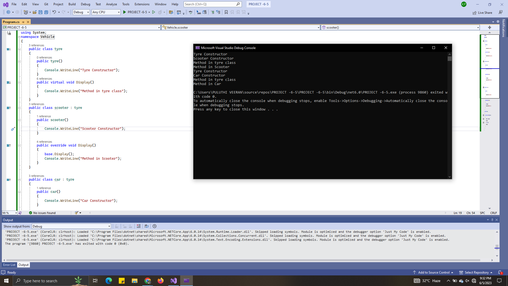

# Inheritance

# Aim:
To write a C# program to print some messages using hierarchical inheritance

# Algorithm:
### step 1:
Create a base class.

### Step 2:
Create two child class.

### step 3:
Create a constructor in the base class and print a message.

### step 4:
create a function in child class to print a message.

# Program:
```
Developed by: KRISHNA PRAKAASH D M
Register number: 212221230052

```


```
using System;
namespace Vehicle
{
    public class tyre
    {
        public tyre()
        {
            Console.WriteLine("Tyre Constructor");
        }
        public virtual void Display()
        {
            Console.WriteLine("Method in tyre class");
        }
    }
    public class scooter : tyre
    {
        public scooter()
        {
            Console.WriteLine("Scooter Constructor");
        }

        public override void Display()
        {
            base.Display();
            Console.WriteLine("Method in Scooter");
        }
    }

    public class car : tyre
    {
        public car()
        {
            Console.WriteLine("Car Constructor");
        }

        public override void Display()
        {
            base.Display();
            Console.WriteLine("Method in Car");
        }
    }
    public class Program
    {
        public static void Main(string[] args)
        {
            scooter s = new scooter();
            s.Display();
            car c = new car();
            c.Display();
        }
    }
}
```


# Output:



# Result
Thus C# program to print some messages using hierarchical inheritance is written and executed sucessfully.

